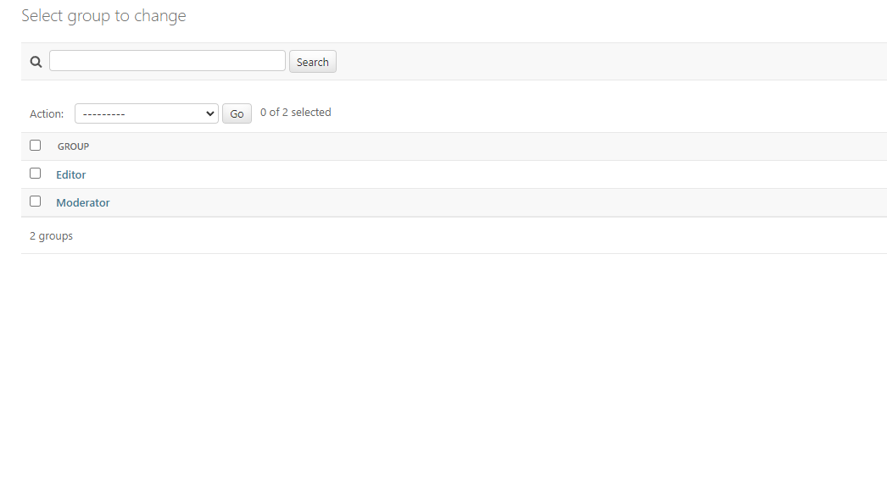

# Features
## Navigation
To navigate the website without taking much real estate, which would inhibit the users reading experience, it was decided to use a toggler to open up the nav panel on mobile and desktop devices.

Here is the the toggler in the right top corner seen on mobile devices:  

When opened up the Menu is presented, holding the following links when logged out:
- News (Opens up the news feed)
- About (Opens up the about page)
- Register (Opens the register form)
- Login (Opens the Sign In form)
- Contact Us (Opens the Contact Form)

When logged in the following links are presented:
- News (Opens up the news feed)
- About (Opens up the about page)
- Admin Panel (Opens the admin panel; Only for Staff visible, excluding moderators)
- Logout
- Contact Us

## Newsfeed
On the home page sits the newsfeed holding all articles that are marked as published by the Authors and which is sorted by most recently published as default.
### Breaking News
The editors who write the articles or the admin have the ability to mark articles as "Breaking News" which then get presented at the top of the page, take up more width on the screen and get a banner added to them.   
It is possible to mark more as one article as breaking news, when this happens they also are sorted by most recently published as default.

### Normal News
As said earlier, the other articles are presented in the newsfeed when marked as published and sorted by most recent date. On tablets and mobile devices the articles are shown one under each other whilst on bigger devices they are presented in two columns.

## Footer
The Footer is very basic and doesn't hold that much information. It holds the name of the author with a link to the Github page, a logo which is a link back to the top of the page and a Copyright note.

## About
The about page holds some short information about the company and the team and shows a picture of them together at a beach.

## Register
Everyone can register a new account on the Sign Up page. Needed is only a username and a password, whilst providing an email address is optional at this time. To widen the user base and don't infringe the privacy of the users more than absolutely needed, the decision was made for the early version of the website to collect as little data as possible. For possible future functionalities more information will be needed from the users.

## Login/Logout
For the log in process a form is provided asking for the user name and the password. When correctly provided, the user gets redirected to the home page.

When the user clicks on Log Out in the menu, a confirmation page is provided on which he can confirm to log out. Afterwards the user is redirected to the home page.

## Contact Us
For contacting the news agency a form is provided that needs the users to fill in the:
- Name
- Email
- Reason (Dropdown Menu)
    - Question
    - Feedback
    - Collaboration Request
    - Other
- Message

After sending the message the user gets informed that the message was sent successfully and is redirected to the home page.

## Articles in Detail
When clicking on any article in the newsfeed, the user is redirected to a more detailed page of the article containing the full text and the ability to like and comment.

## Comments
At the bottom of each article page is a Form field provided in which users can write their comments and submit them when logged in.
Also the ability to edit or delete the own comments is provided through two buttons at the bottom of each individual comment.

## Likes
Users are also provided with the ability to like articles. For that the user also needs to be logged in then he can click on each article page on the heart under the article to like a comment or unlike it. The likes are also displayed in the newsfeed to inform users about current trends.

## Admin Panel
The admin panel is only used for staff that actively writes articles and manages the page. Therefore only the site admin, which is the superuser, and the editors are allowed to access it, with varying abilities to change things around and interact with elements. Whilst the editors have a restricted access the admin can access everything the editors can and more.
### Editor
Here is an overview of the admin panel for editors:

The editors can see contact requests and delete them when they have responded to them but have no ability to manipulate the messages since it isn't needed to fulfill their tasks.

The next part of the website the editors can interact with through the admin panel are obviously the articles, since it is the job of the editors to write them and moderate them as needed.  
The editors can write up new articles using a wide range of functions provided with Django Summernote and edit articles later on or delete them.

To provide the editors with the ability to moderate comments when needed they also have full access on comments through the admin panel. Here the overview and the abilities to edit and delete comments as presented to the admins.

### Admin
As stated earlier the admin has all the abilities the editors have and more. Here is an overview of the Admin Panel seen when logged in as an admin:  

Whilst the admin has a wide range of abilities, the most important ones are listed here.  
To govern the different groups of people effectively, can the admin create different groups and assign users to them. Through this the different permissions for each user are given.

Further has the admin the ability to manage different user profiles directly and change information or permissions. This is important since the users have no automated way right now to change any of their information or passwords themselves.

## Moderator
One important group created are the moderators. When the site grows it will become harder and harder to moderate and approve all the comments. Therefore, to allow for smooth scaling the Site owner has the ability to assign users the moderator roll. With that they are able to approve, edit and delete comments of other users, without needing to log into the admin panel, through buttons visible for them under every comment. This takes a major work load off of the editors which can then focus more on the creative part.

