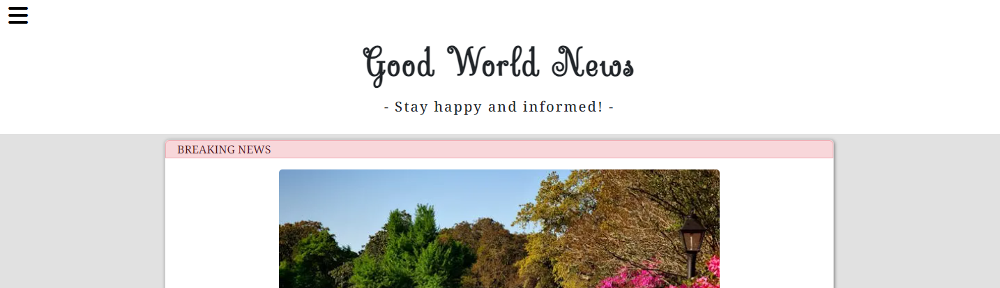
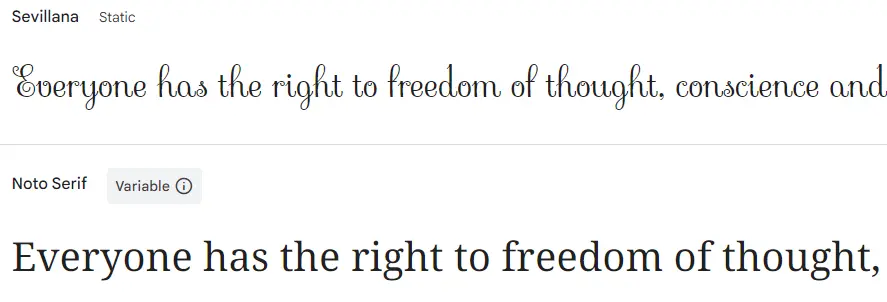

# Good World News
Live Version: [Heroku](https://good-world-news-027ba952aa1a.herokuapp.com/)

Repository: [Github](https://github.com/MrMarlonM/good-world-news)

Developed By: [Marlon Martynkiewitz](www.linkedin.com/in/marlon-martynkiewitz-software-dev)

## About
Good World News is the News Website for everyone that needs a dose of positivity. The aim is to provide regular updates about everything positive happening on our planet and beyond. No more, no less.

## User Experience Design
### The Big Picture
The website was created for everyone that needs a break from the chaos of their day-to-day life and the focus is on creating a calm and relaxing atmosphere. For that a light background was chosen, together with big, easily readable and clearly separated content.  
The navigation is kept simple and intuitive to use whilst making sure everything is accessible on desktops as well as on mobile phones and tablets.

### Target Audience
The target audience for this news website are curious people who have a general interest in nature, culture and their surroundings, but only want to hear about the good parts of the news cycle.  
And most important: People that just need a break and want to relax in an environment that guarantees to be free from any disturbing information.

### Epics and User Stories
To make sure the interests of the target audience are met, the following Epics with their respective User Stories where created:

#### [**EPIC 1:**](https://github.com/MrMarlonM/good-world-news/issues/33) News Feed as an endless scroll
- [**USER STORY:**](https://github.com/MrMarlonM/good-world-news/issues/24) As a visitor I can see the latest news on the homepage so that I can directly dive into it without further disruption

- [**USER STORY:**](https://github.com/MrMarlonM/good-world-news/issues/25) As a visitor I can see more articles when I'm scrolling down so that I do not need to load a new site to see more content

- [**USER STORY:**](https://github.com/MrMarlonM/good-world-news/issues/26) As a visitor I can sort the articles as needed so that I can directly see content most relevant to me

#### [**EPIC 2:**](https://github.com/MrMarlonM/good-world-news/issues/30) Logging in as an editor
- [**USER STORY:**](https://github.com/MrMarlonM/good-world-news/issues/10) As an editor I can create new articles so that I can update the endless feed with the latest news

- [**USER STORY:**](https://github.com/MrMarlonM/good-world-news/issues/8) As an editor I can log in so that I can access the editor dashboard

- [**USER STORY:**](https://github.com/MrMarlonM/good-world-news/issues/11) As an editor I can edit my own articles so that I can correct mistakes and adapt to changing events

- [**USER STORY:**](https://github.com/MrMarlonM/good-world-news/issues/12) As an editor I can delete my own articles so that I can remove content that is not relevant anymore

- [**USER STORY:**](https://github.com/MrMarlonM/good-world-news/issues/9) As an editor I can change my password so that I can maintain a high level of security

#### [**EPIC 3:**](https://github.com/MrMarlonM/good-world-news/issues/31) Admin panel for moderation of the platform
- [**USER STORY:**](https://github.com/MrMarlonM/good-world-news/issues/14) As a site administrator I can manage user accounts so that I can keep everything in order

- [**USER STORY:**](https://github.com/MrMarlonM/good-world-news/issues/15) As a site administrator I can delete comments so that I can remove illegal content

- [**USER STORY:**](https://github.com/MrMarlonM/good-world-news/issues/17) As a site admin I can approve comments before they are published so that no illegal content is posted

- [**USER STORY:**](https://github.com/MrMarlonM/good-world-news/issues/16) As a moderator I can approve new and edited comments before they are published so that no illegal content is posted

- [**USER STORY:**](https://github.com/MrMarlonM/good-world-news/issues/13) As a moderator I can delete comments so that I can remove illegal content

- [**USER STORY:**](https://github.com/MrMarlonM/good-world-news/issues/18) As a site admin I can view web analytics so that I'm informed about trends

#### [**EPIC 4:**](https://github.com/MrMarlonM/good-world-news/issues/36) Website Accessibility
- [**USER STORY:**](https://github.com/MrMarlonM/good-world-news/issues/23) As a mobile user I can clearly see the content on the web page so that I can enjoy the experience

- [**USER STORY:**](https://github.com/MrMarlonM/good-world-news/issues/22) As a mobile user I can navigate the website easily so that everything is accessible

- [**USER STORY:**](https://github.com/MrMarlonM/good-world-news/issues/21) As a handicapped person I can use a screen reader to navigate the website so that I'm included as a possible user

#### [**EPIC 5:**](https://github.com/MrMarlonM/good-world-news/issues/34) Contact Form to reach the Company
- [**USER STORY:**](https://github.com/MrMarlonM/good-world-news/issues/27) As a visitor I can contact the company so that I can provide feedback or ask questions

#### [**EPIC 6:**](https://github.com/MrMarlonM/good-world-news/issues/32) About Page
- [**USER STORY:**](https://github.com/MrMarlonM/good-world-news/issues/20) As a visitor I can visit the about page so that I learn more about the company and the team

- [**USER STORY:**](https://github.com/MrMarlonM/good-world-news/issues/19) As a visitor I can see the mission statement and values of the company so that I know what they stand for and what I can expect

#### [**EPIC 7:**](https://github.com/MrMarlonM/good-world-news/issues/28) Registration Form
- [**USER STORY:**](https://github.com/MrMarlonM/good-world-news/issues/2) As a new visitor I can create an account so that I can use advanced features

#### [**EPIC 8:**](https://github.com/MrMarlonM/good-world-news/issues/29) Logging in as a Visitor
- [**USER STORY:**](https://github.com/MrMarlonM/good-world-news/issues/6) As a registered user I can Log In to my account so that I can use advanced features

- [**USER STORY:**](https://github.com/MrMarlonM/good-world-news/issues/7) As a registered user I can change my password so that I can secure my account if needed

#### [**EPIC 9:**](https://github.com/MrMarlonM/good-world-news/issues/35) User Interaction
- [**USER STORY:**](https://github.com/MrMarlonM/good-world-news/issues/3) As a registered user I can comment on posts so that I can share my thoughts and interact with other users and the authors

- [**USER STORY:**](https://github.com/MrMarlonM/good-world-news/issues/4) As a registered user I can like articles so that I show that I show my appreciation of it

- [**USER STORY:**](https://github.com/MrMarlonM/good-world-news/issues/5) As a visitor I can share articles easily through a button so that I can send them to others or share them on social media with ease

#### [**EPIC 10:**](https://github.com/MrMarlonM/good-world-news/issues/37) Breaking News
- [**USER STORY:**](https://github.com/MrMarlonM/good-world-news/issues/38) As a editor I can add an article as breaking news so that I can inform users easily and fast about important news

## Technologies Used
### Languages
- [Python 3.12.2](https://www.python.org/downloads/release/python-3122/): As primary server-side language.
- [JavaScript](https://developer.mozilla.org/en-US/docs/Web/JavaScript): For interactivity on the website.
- [CSS](https://developer.mozilla.org/en-US/docs/Web/CSS): To style the website.
- [HTML](https://developer.mozilla.org/en-US/docs/Web/HTML): The markup language for the website.

### Frameworks and Libraries
- [Django](https://www.djangoproject.com/): The framework used for the logic behind the project.
- [Bootstrap](https://getbootstrap.com/): The library used for styling and customization.

### Tools and Helpers
- [Freeconvert](https://www.freeconvert.com/webp-converter): To convert images into webp.
- [Pexels](https://www.pexels.com/): For free images.
- [Google Gemini](https://gemini.google.com/): To write the Fiction Articles
- [Balsamiq](https://balsamiq.com/): For creation of the Wireframes and Database Models
- [Fontawesome](https://fontawesome.com/): For icons used on the website.
- [Google Fonts](https://fonts.google.com/): For implementation of different fonts.
- [Heroku](https://www.heroku.com/): To host the live version
- [Github](https://github.com/): To host the code base
- [Git](https://git-scm.com/): For version control
- [VS Code](https://code.visualstudio.com/): As Code Editor
- [Gitpod](https://www.gitpod.io/): As Virtual Development Environment
- [Pip3](https://pypi.org/project/pip/): As package manager for dependencies.
- [Allauth](https://django-allauth.readthedocs.io/en/latest/): For authentication of different users.
- [Spycopg2](https://pypi.org/project/psycopg2/): As database driver to connect to the database.
- [Gunicorn](https://gunicorn.org/): As web server to run the website.
- [PostgreSQL from Code Institute](https://dbs.ci-dbs.net/): As cloud database to store the data.
- [Chrome Dev Tools](https://developer.chrome.com/docs/devtools/open/): For debugging the Website.

## Features
For an overview of the provided features, please refer to the [FEATURES](/FEATURES.md).

## Design
To make the website as easily usable as possible and create a calm and pleasant experience, a very minimalistic approach was used. Large open spaces make it easy to focus on the relevant content and let the texts and images on the page be in the spotlight.

### Color Scheme
To maintain readability and focus on the words written, a very hormonic color palette with maximal contrast was used.  

  

### Typography
As Font for the Title was "Sevillana" used because of its elegance. To maintain a good readability for all functional text and to website "Noto Serif" was used. Also the Editors can choose their own font for the articles through Summernote. 

### Wireframes
For the Wireframes drawn for this project please refer to [this PDF](documentation/wireframes-good-world-news.pdf).

## Bugs
### Solved Bugs
- *Bug 1:*  
When applying height and width to images in the Newsfeed, the images didn't render properly and stretched or compressed without keeping the right ratio.  
*Solution:*  
To solve the issue, the `width` was set to a `percent value` and the `height` to `auto`

- *Bug 2:*  
When using a url variable `contact_url` in the `base.html` template, it didn't work as intended and couldn't find the corresponding url.  
*Solution:*  
When trying to solve the issue, I found that assigning variables at the top of the template does not work and the issue was resolved through defining the link directly over the url name `href=""` as given in the `urls.py`.

- *Bug 3:*  
When starting the server in development it didn't work and the server crashed. In the console a `TypeError` was encountered.  
*Solution:*  
The cause for this was a typo in the `forms.py` file within the `contact` app. The instead of an `EmailInput` field an `EmailField` was used which is an unexpected keyword.

- *Bug 4:*  
When using `Summernote` to decorate the articles it didn't work and the page was printing all html tags as plain text.  
*Solution:*  
The problem arose because of Django's build in feature to escape HTML content automatically for security reasons. To solve the problem the template filter `safe` was used.

- *Bug 5:*  
When deploying the project to `Heroku` it it did not work as expected and the App did not start at all.  
*Solution:*  
The problem was twofold. First `Heroku` wasn't listed as allowed host which was resolved through adding `.herokuapp.com` to the `ALLOWED_HOSTS` list. The second problem was a typo in the `CSRF_TRUSTED_ORIGINS` list. Here I forgot to add the `.` before `herokuapp.com`.

- *Bug 6:*  
The toggler for the navigation panel did stop showing at the top when scrolling down.  
*Solution:*
The problem was that the toggler was part of the header element and not of the body element, also the `height: 100vh` property of the body element needed to be removed to allow for the toggler to stay visible all the way down to the bottom of the page.

### Unsolved Bugs
- Images that are provided through Cloudinary are linked as http instead of https. This affects the performance of the website in Lighthouse.

- When a user makes a mistake whilst logging in or registering and submits the respective form, the page just reloads and empties the form, but no message is presented to the user. The allauth plugin seems to be not working correctly here. A possible problem could be the template handling or the deletion of some needed files.

## Mistakes
- Whilst deploying the project the first few times, I didn't put the local `db.sqlite` database into the `gitignore` file, which exposed it publicly. Since I didn't use the database, no sensible information was shared. To clean up the codebase of the project I later deleted the file altogether.

## Credits
- For the navbar of this project I referenced the code of the [Codestar Walkthrough Project](https://github.com/MrMarlonM/django-blog) provided by Code Institute. 
- For the basic comment section HTML and Javascript implementation I referenced the code of the [Codestar Walkthrough Project](https://github.com/MrMarlonM/django-blog) provided by Code Institute. However, the functionality was widened and I built on top of it.

## Acknowledgments
- I want to thank [Iuliia Konovalova](https://github.com/IuliiaKonovalova) for her guidance and support throughout this project.
- A big thank you to all of the Team of [Code Institute](https://codeinstitute.net/) for providing the learning content which enabled me to create this project.