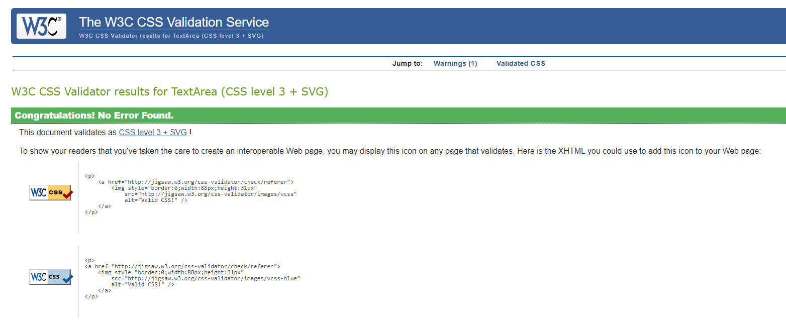
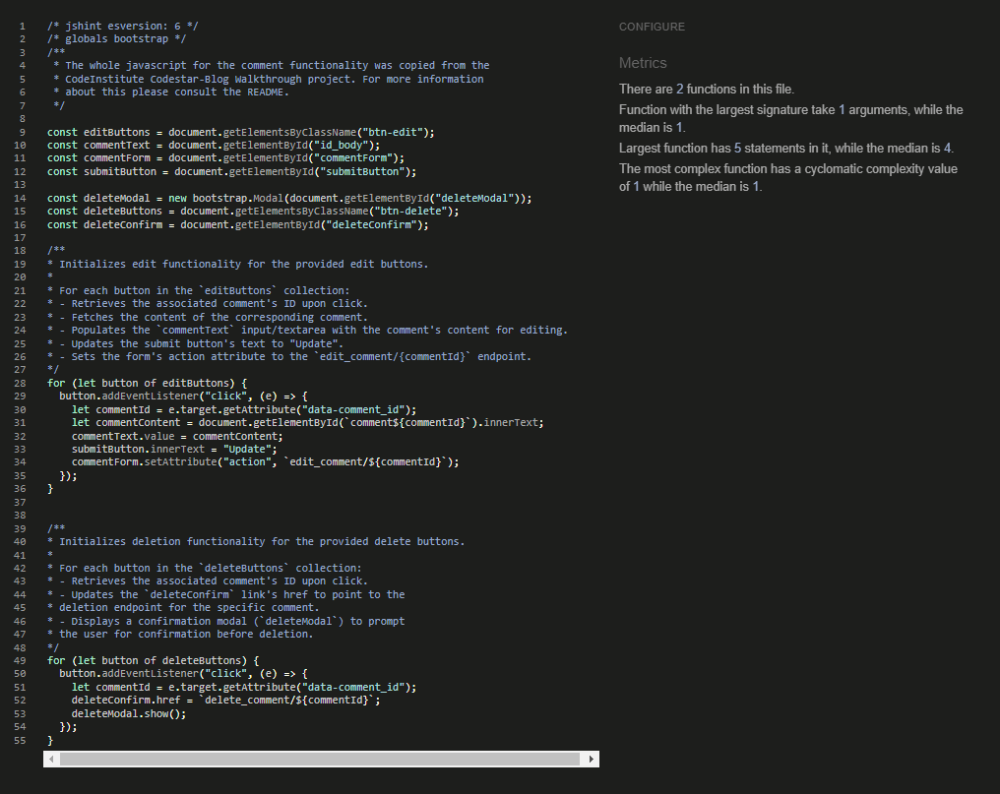
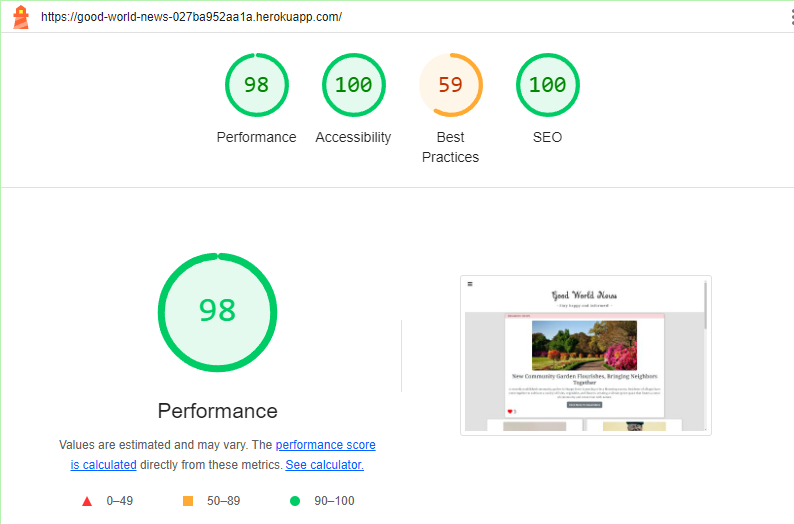
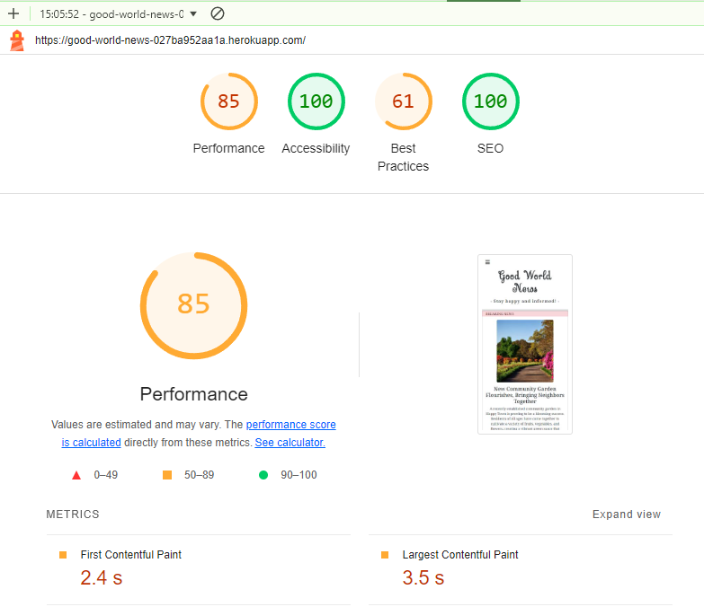
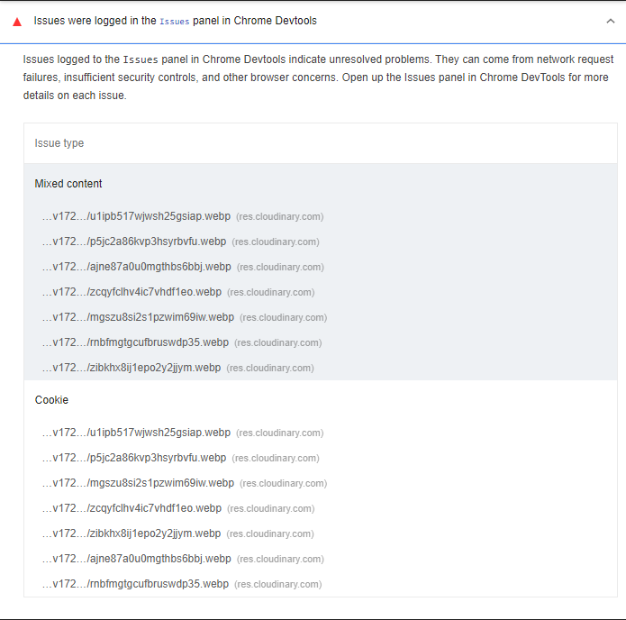

# Testing
## Manual Testing
### Iteration 1
#### User Story: [Breaking news for editor](https://github.com/MrMarlonM/good-world-news/issues/38)
- Acceptance Criteria:
    - Through a checkbox I can easily add or un-add articles as breaking news
    - The article shows prominently at the top of the page
- Manual Steps:
    - d
- Expected Outcome:
    - d
- Actual Outcome:
    - d

#### User Story: [User-friendly design](https://github.com/MrMarlonM/good-world-news/issues/23)
- Acceptance Criteria:
    - The design is responsive to different screen sizes
    - On every size the font is clearly readable
    - Images adjust their size accordingly
    - The elements position themselves according to the screen size
- Manual Steps:
    - d
- Expected Outcome:
    - d
- Actual Outcome:
    - d

#### User Story: [Newsfeed on homepage](https://github.com/MrMarlonM/good-world-news/issues/24)
- Acceptance Criteria:
    - All articles are listed on the homepage
    - The articles are listed by date as default
    - The title, short description and image can be seen
    - When clicked on, the articles opens in full
- Manual Steps:
    - d
- Expected Outcome:
    - d
- Actual Outcome:
    - d

#### User Story: [Manage user accounts as admin](https://github.com/MrMarlonM/good-world-news/issues/14)
- Acceptance Criteria:
    - The administrator can view user accounts
    - The administrator can edit user accounts
    - The administrator can delete user accounts
- Manual Steps:
    - d
- Expected Outcome:
    - d
- Actual Outcome:
    - d

#### User Story: [Create Articles as editor](https://github.com/MrMarlonM/good-world-news/issues/10)
- Acceptance Criteria:
    - It is possible to provide a styled text
    - It is possible to add a picture
    - It is possible to add a short description
- Manual Steps:
    - d
- Expected Outcome:
    - d
- Actual Outcome:
    - d

#### User Story: [Edit Articles as editor](https://github.com/MrMarlonM/good-world-news/issues/11)
- Acceptance Criteria:
    - All articles can be changed
    - The text, title and short description are changeable as well as the image
- Manual Steps:
    - d
- Expected Outcome:
    - d
- Actual Outcome:
    - d

#### User Story: [Delete Articles as editor](https://github.com/MrMarlonM/good-world-news/issues/12)
- Acceptance Criteria:
    - It is possible to delete own articles in the editor dashboard
    - After deletion the article is not visible anymore as well as all linked comments.
- Manual Steps:
    - d
- Expected Outcome:
    - d
- Actual Outcome:
    - d

#### User Story: [Login form for registered users](https://github.com/MrMarlonM/good-world-news/issues/6)
- Acceptance Criteria:
    - A log in form is provided where the user can log in with his user name and password
    - Once logged in the User can use all the provided functions.
    - The log in button is found in the menu
- Manual Steps:
    - d
- Expected Outcome:
    - d
- Actual Outcome:
    - d

#### User Story: [Registration Form](https://github.com/MrMarlonM/good-world-news/issues/2)
- Acceptance Criteria:
    - A form is provided to fill in name, email and password for registration
    - After registration the user can directly log into the created account
- Manual Steps:
    - d
- Expected Outcome:
    - d
- Actual Outcome:
    - d

#### User Story: [Login form for editor](https://github.com/MrMarlonM/good-world-news/issues/8)
- Acceptance Criteria:
    - A login form is provided for editors
    - After logging in the editor can access the editor dashboard
- Manual Steps:
    - d
- Expected Outcome:
    - d
- Actual Outcome:
    - d

#### User Story: [Mobile-friendly navigation](https://github.com/MrMarlonM/good-world-news/issues/22)
- Acceptance Criteria:
    - The navigation bar is toggle-able so that it doesn't use to much real estate
    - The nav bar is easily findable at the top of the screen at all times
    - Buttons and links are clearly stated as such and distinct from other content
    - Buttons are big enough to be pressed on a touch screen
- Manual Steps:
    - d
- Expected Outcome:
    - d
- Actual Outcome:
    - d

#### User Story: [Contact Form](https://github.com/MrMarlonM/good-world-news/issues/27)
- Acceptance Criteria:
    - A feedback form is provided
    - The name, mail and message can be put in
    - The message is visible to the administrator
    - The administrator is notified when a new message gets sent.
- Manual Steps:
    - d
- Expected Outcome:
    - d
- Actual Outcome:
    - d

### Iteration 2
#### User Story: [Website accessibility](https://github.com/MrMarlonM/good-world-news/issues/21)
- Acceptance Criteria:
    - Aria-labels are given for every link
    - Every image has alt-attributes
- Manual Steps:
    - d
- Expected Outcome:
    - d
- Actual Outcome:
    - d

#### User Story: [About page](https://github.com/MrMarlonM/good-world-news/issues/20)
- Acceptance Criteria:
    - An about page is existent
    - Information about the company and the team is found there
    - The information is visible for everyone
- Manual Steps:
    - d
- Expected Outcome:
    - d
- Actual Outcome:
    - d

#### User Story: [Admin delete comments](https://github.com/MrMarlonM/good-world-news/issues/15)
- Acceptance Criteria:
    - Every comment can be deleted
    - After deletion the comment is not visible anymore
- Manual Steps:
    - d
- Expected Outcome:
    - d
- Actual Outcome:
    - d

#### User Story: [Change the password as editor](https://github.com/MrMarlonM/good-world-news/issues/9)
- Acceptance Criteria:
    - Inside the editor dashboard is a button to change the password
    - The change takes place immediately
- Manual Steps:
    - d
- Expected Outcome:
    - d
- Actual Outcome:
    - d

#### User Story: [Like articles](https://github.com/MrMarlonM/good-world-news/issues/4)
- Acceptance Criteria:
    - Logged in users can like articles
    - Every user can like each article only once
    - The likes for each article are counted and visible for everybody
- Manual Steps:
    - d
- Expected Outcome:
    - d
- Actual Outcome:
    - d

#### User Story: [User comment delete/edit](https://github.com/MrMarlonM/good-world-news/issues/39)
- Acceptance Criteria:
    - Under each comment is a button for deletion
    - Under each comment is a button for edit
    - The deletion asks for confirmation
    - The edit field is the same as the comment field
- Manual Steps:
    - d
- Expected Outcome:
    - d
- Actual Outcome:
    - d

#### User Story: [Commenting on articles](https://github.com/MrMarlonM/good-world-news/issues/3)
- Acceptance Criteria:
    - When logged in a comment form is provided
    - Every article can be commented by every user
    - A confirmation that the comment was submitted or that there was an error is provided
- Manual Steps:
    - d
- Expected Outcome:
    - d
- Actual Outcome:
    - d

#### User Story: [Admin comment approval](https://github.com/MrMarlonM/good-world-news/issues/17)
- Acceptance Criteria:
    - Comments need to be approved before they are visible
- Manual Steps:
    - d
- Expected Outcome:
    - d
- Actual Outcome:
    - d

#### User Story: [Moderator comment approvement](https://github.com/MrMarlonM/good-world-news/issues/16)
- Acceptance Criteria:
    - Before a comment is visible publicly it must be approved
    - Moderators and admins are notified of new comments that are awaiting approval
- Manual Steps:
    - d
- Expected Outcome:
    - d
- Actual Outcome:
    - d

#### User Story: [Delete comments as moderator](https://github.com/MrMarlonM/good-world-news/issues/13)
- Acceptance Criteria:
    - A moderator can delete any content
    - After deletion a comment is not visible anymore
- Manual Steps:
    - d
- Expected Outcome:
    - d
- Actual Outcome:
    - d

## Automated Testing

## Browser and Device Compatibility

## Code Validation
### HTML
The HTML code of the project was validated using the [W3C Markup Validation Service](https://validator.w3.org/).

Please refer to [this PDF](documentation/html-validation.pdf) containing all testing documentation.

### CSS
The CSS code of the project was verified using the [W3 jigsaw verification tool](https://jigsaw.w3.org/css-validator/).

### JavaScript
The Javascript code used in this project was verified using the [JS Hint](https://jshint.com/) linter.

### Python
For validation of the python code written throughout the project, please refer to the [Python Testing PDF](documentation/python-validation.pdf).

### Performance (Google Lighthouse)
The performance of the website was tested using [Google Lighthouse](https://developer.chrome.com/docs/lighthouse/overview).

Whilst the score was mostly good, the performance was a little slower on mobile devices through the images not being optimized for smaller screens.  
However, through using the `Cloudinary` integration for Django it will be possible to automatically optimize images for screen sizes and internet speed but for this stage of the project I did not look further into it.  
The same is true for not optimal Best Practices score. This comes through Cloudinary using third-party-cookies on the website and sending images over as http instead of https.  
Both problems which should be solvable in a future edition of the website through refining the Cloudinary implementation.

Please click [here](/README.md) to get back to the README.